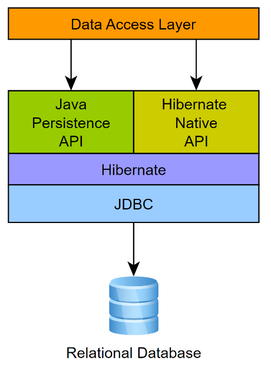
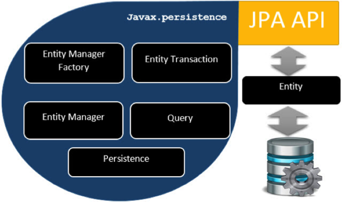
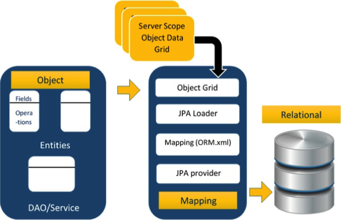
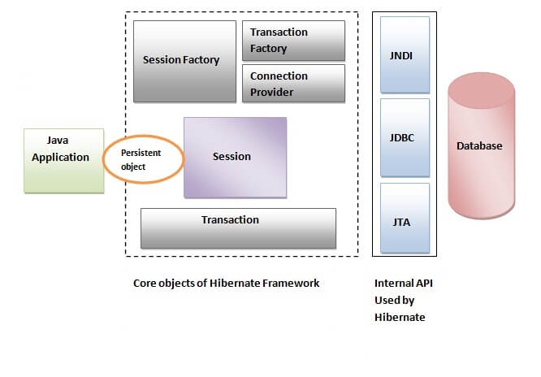
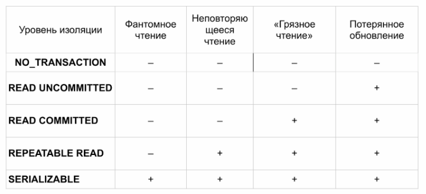
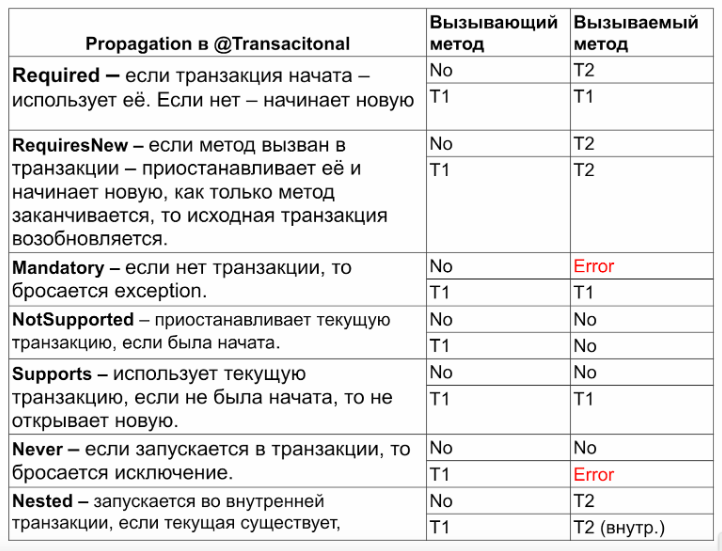

# Работа с БД из кода

## Impedance Mismatch
Impedance mismatch — термин, обозначающий несоответствие парадигм объектно-ориентированного и реляционного программирования. 
Классы только на первый взгляд схожи с таблицами, а объекты со строками.

## Jpa и ORM
ORM (Object Relational Mapping) позволяет отображать сущности на базу данных и наоборот. 

JPA (Java Persistence API) — это набор интерфейсов и аннотаций для разметки классов-сущностей, объясняющий ORM, как с этими классами работать.

## Обзор JPA
Разбиение по компонентам

Детальное представление классов

Процесс работы JPA

Устройство Hibernate

## Транзакции

Транзакция — это набор операций по работе с базой данных (БД), объединенных в одну атомарную пачку.

### Принципы ACID
- Atomicity (Атомарность): Все операции внутри транзакции либо полностью выполняются, либо полностью откатываются.
- Consistency (Согласованность): Транзакция переводит базу данных из одного согласованного состояния в другое.
- Isolation (Изоляция): Одновременные транзакции не должны влиять друг на друга.
- Durability (Долговечность): После подтверждения выполнения транзакции ее результаты сохраняются в базе данных даже в случае сбоя системы.

### Уровень изоляции

### Propagation 
определяет, как будет вести себя текущая транзакция относительно других транзакций

# Логи
В проекте в тестовых ресурсах лежат файлы.

ddl-create mappedBy.txt и ddl-create without mappedBy.txt отображает работу настройки mappedBy и ddl-auto.
При отсутствии настройки mappedBy Hibernate создаст промежуточную таблицу

В файлах n+1.txt и not n+1.txt демонстрация проблемы запросов к БД при наличии связанных сущностей